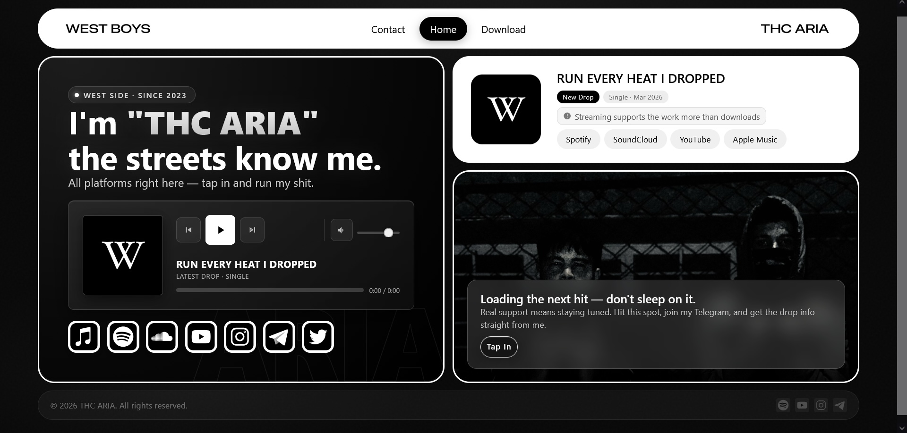

<div align="center">

# 🎤 THC ARIA — Official Artist Portfolio

**A sleek, single-page artist landing site — stream music, browse the discography, and connect — built with nothing but vanilla HTML, CSS, and JavaScript.**

[](#license)
[](#)


[](#)

</div>

---

## 📸 Preview

> Add real screenshots to `docs/images/` and update the paths below.



---

## 🚀 Live Demo

https://thewestboy.github.io/music-artist-portfolio/

---

## 📑 Table of Contents

- [Features](#-features)
- [Tech Stack](#-tech-stack)
- [Architecture](#-architecture)
- [Folder Structure](#-folder-structure)
- [Installation](#-installation)
- [Getting Started](#-getting-started)
- [Configuration](#-configuration)
- [Usage](#-usage)
- [Responsive Design](#-responsive-design)
- [Performance](#-performance)
- [Accessibility](#-accessibility)
- [Browser Support](#-browser-support)
- [Deployment](#-deployment)
- [Security Notes](#-security-notes)
- [Roadmap](#-roadmap)
- [Contributing](#-contributing)
- [Code Style](#-code-style)
- [FAQ](#-faq)
- [License](#-license)
- [Acknowledgements](#-acknowledgements)
- [Author](#-author)
- [Support](#-support)

---

## ✨ Features

- 🎵 **Custom audio player** — play/pause, prev/next, click-and-drag progress seeking (mouse + touch), volume slider with mute toggle, and keyboard shortcuts (`Space`, `M`, `←`/`→`)
- 🌀 **Animated loading screen** with a simulated progress bar before the page reveals
- 📌 **Sticky header** that visually reacts to scroll position
- 🪩 **3D tilt effect** on the album cover, following cursor movement
- 🪟 **Accessible modal system** — focus trap, `Escape`-to-close, backdrop-click-to-close, and focus restoration on close
- 💿 **Dynamic discography list** rendered from a JavaScript data array, with simulated per-track download feedback (loading → done states + toast)
- ✉️ **Contact form** with real-time client-side validation (name, email format, message) and a simulated async submit flow
- 🔔 **Toast notification system** for lightweight user feedback
- 🔗 **Streaming & social platform links** (Spotify, Apple Music, SoundCloud, YouTube, Instagram, Telegram, X) embedded as inline SVG icons
- 📱 **Fully responsive layout** with dedicated breakpoints at `1100px`, `768px`, and `480px`
- 🔍 **SEO & social metadata** — Open Graph and Twitter Card tags pre-configured in `index.html`

---

## 🛠 Tech Stack

| Layer              | Technology                                  |
|---------------------|----------------------------------------------|
| Markup              | HTML5 (semantic elements, ARIA roles)         |
| Styling             | CSS3 (custom properties, CSS Grid, Flexbox, media queries) |
| Scripting           | Vanilla JavaScript (ES6+, no dependencies)    |
| Media               | HTML5 `<audio>` API                           |
| Icons               | Inline SVG                                    |
| Build Tooling       | None — zero-config static site                |
| Package Manager     | None — no `package.json` / external packages  |
| Hosting             | Static hosting (Netlify / Vercel / GitHub Pages) |

> ℹ️ This project intentionally ships with **no framework, bundler, or dependency** — it's pure HTML/CSS/JS, runnable by simply opening `index.html` or serving the folder statically.

---

## 🏗 Architecture

The project follows a simple, file-per-concern static architecture:

```
index.html   → Structure & content (DOM, ARIA, metadata)
style.css    → All visual styling, design tokens (CSS custom properties), and responsive rules
script.js    → All behavior: player logic, modals, form handling, DOM rendering
```

**Key architectural patterns used in `script.js`:**

- **Module-style sections** — the file is organized into clearly delimited blocks (Utils, Loader, Audio Player, Modal System, Download List, Contact Form), each self-contained and operating on its own DOM subtree.
- **Declarative data → DOM rendering** — the discography track list is generated from a plain JS array (`discography`) and injected into the DOM via `innerHTML`, rather than being hardcoded in HTML.
- **Centralized modal controller** — `openModal()` / `closeModal()` manage a single `activeModal` reference, handling focus trapping and ARIA state for both the Download and Contact dialogs.
- **Event delegation** — the track list uses a single delegated click listener (on `#trackList`) rather than per-button listeners, keeping the render step cheap.
- **No external state management** — UI state (current track, modal open/closed, drag state) lives in simple top-level `let` variables, appropriate for the project's scope.

<details>
<summary><strong>📂 Component map (click to expand)</strong></summary>

| Component            | DOM Root           | Responsible Script Section |
|------------------------|---------------------|------------------------------|
| Loading Screen          | `#loader`            | `initLoader()` |
| Sticky Header           | `#siteHeader`         | Scroll listener |
| Bio Card + Mini Player  | `.card-bio` / `#audio` | Audio Player block |
| Album Cover Tilt        | `#albumCover`         | 3D Tilt block |
| Track Card              | `.card-track`         | Static HTML (driven by player state) |
| Photo / CTA Card        | `.card-photo`         | Static HTML |
| Download Modal          | `#downloadBackdrop`   | Modal System + Download block |
| Contact Modal           | `#contactBackdrop`    | Modal System + Contact Form block |
| Toast                   | `#toast`              | `showToast()` |

</details>

---

## 📁 Folder Structure

```
music-artist-portfolio/
├── index.html        # Main HTML document (structure, metadata, modals)
├── style.css          # All styling — design tokens, layout, responsive rules
├── script.js          # All client-side behavior and interactivity
├── images/            # Artist photos, logos, album art (referenced, not included)
└── audio/             # Track audio files (referenced, not included)
```

> ⚠️ The `images/` and `audio/` directories are **referenced in code but not bundled** in this repository. You'll need to supply your own media assets matching the paths used in `index.html` and `script.js` (see [Configuration](#-configuration)).

---

## ⚙️ Installation

No build step, no dependencies, no package manager required.

```bash
# Clone the repository
git clone https://github.com/thewestboy/music-artist-portfolio

# Move into the project directory
cd music-artist-portfolio
```

That's it — there is nothing to `npm install`.

---

## 🚀 Getting Started

You can run this project in two ways:

**Option 1 — Open directly**

Simply open `index.html` in your browser. Note that some browsers restrict `<audio>`/local file behavior under the `file://` protocol, so a local server is recommended.

**Option 2 — Serve locally (recommended)**

```bash
# Using Python
python3 -m http.server 8000

# Or using Node's http-server (if installed globally)
npx http-server .
```

Then open `http://localhost:8000` in your browser.

---

## 🔧 Configuration

There are no environment variables or `.env` files in this project — all configuration lives directly in the source files:

| What                          | Where                                  |
|--------------------------------|------------------------------------------|
| Site metadata (title, OG tags) | `index.html` `<head>`                    |
| Track playlist (mini player)   | `playlist` array in `script.js`           |
| Discography / download list    | `discography` array in `script.js`        |
| Platform & social links        | Hardcoded `<a>` tags in `index.html`      |
| Design tokens (colors, spacing, fonts) | `:root` CSS custom properties in `style.css` |

> 📝 **Before deploying:** Replace placeholder platform URLs (e.g. generic `https://open.spotify.com`) in `index.html` with real artist profile links, and add real audio files at the paths referenced in `script.js`'s `playlist` and `discography` arrays — otherwise playback/downloads will fail gracefully but silently.

---

## 📜 Available Scripts

This project has no `package.json` and therefore no npm scripts. All "running" is done via a static file server (see [Getting Started](#-getting-started)).

---

## 💡 Usage

**Adding a new track to the mini player:**

```js
// script.js
const playlist = [
  { title: "RUN EVERY HEAT I DROPPED", sub: "Latest Drop · Single", src: "./images/va.mpeg" },
  { title: "YOUR NEW TRACK", sub: "New Single", src: "./audio/your-new-track.mp3" },
];
```

**Adding a release to the downloadable discography:**

```js
// script.js
const discography = [
  { title: "Your Track", date: "Jun 2026", duration: "3:30", type: "Single", file: "./audio/your-track.mp3" },
];
```

**Customizing the color theme:**

```css
/* style.css */
:root {
  --bg:    #080808; /* page background */
  --white: #ffffff; /* primary text/surfaces */
}
```

---

## 📱 Responsive Design

The layout is built mobile-first-aware with three explicit breakpoints:

| Breakpoint     | Behavior |
|----------------|----------|
| `> 1100px`     | Two-column grid; bio card spans the full row height |
| `≤ 1100px`     | Grid collapses to a single column; bio card row-span resets |
| `≤ 768px`      | Further spacing/typography adjustments for tablets |
| `≤ 480px`      | Compact padding and type scale for small phones |

---

## ⚡ Performance

- **Lazy-loaded images** — all `` tags use `loading="lazy"`
- **`preload="none"` on `<audio>`** — avoids fetching media until the user interacts with the player
- **No external dependencies** — zero JS/CSS framework overhead, no network requests for libraries
- **Passive scroll/touch listeners** — scroll and touch event handlers are registered with `{ passive: true }` to avoid blocking the main thread

---

## ♿ Accessibility

- Semantic landmarks (`<header>`, `<main>`, `<footer>`, `<nav>`) with descriptive `aria-label`s
- Modal dialogs implement `role="dialog"`, `aria-modal`, focus trapping, and focus restoration on close
- Progress bar uses `role="slider"` with live `aria-valuenow` updates and full keyboard support
- Form fields use associated `<label>`s, `aria-invalid`, and `role="alert"` error messaging
- Toasts and success messages use `aria-live="polite"` for non-intrusive screen reader announcements
- All interactive icons (`<button>`, `<a>`) include descriptive `aria-label`s

---

## 🌐 Browser Support

| Browser         | Supported |
|------------------|:-----------:|
| Chrome (latest)  | ✅ |
| Firefox (latest) | ✅ |
| Safari (latest)  | ✅ |
| Edge (latest)    | ✅ |
| iOS Safari       | ✅ |
| Android Chrome   | ✅ |
| IE11             | ❌ |

> Relies on modern CSS (Grid, custom properties) and ES6+ JavaScript — no transpilation or polyfills are included.

---

## 🚢 Deployment

This is a static site, so it can be deployed to any static host with zero build configuration.

<details>
<summary><strong>Deploy to Netlify</strong></summary>

1. Push this repository to GitHub.
2. In Netlify, click **Add new site → Import an existing project**.
3. Select the repository — leave the build command empty and set the publish directory to `/`.
4. Deploy.

</details>

<details>
<summary><strong>Deploy to Vercel</strong></summary>

1. Push this repository to GitHub.
2. In Vercel, click **Add New → Project** and import the repo.
3. Framework preset: **Other**. No build command required.
4. Deploy.

</details>

<details>
<summary><strong>Deploy to GitHub Pages</strong></summary>

1. Push this repository to GitHub.
2. Go to **Settings → Pages**.
3. Set the source branch to `main` and the folder to `/ (root)`.
4. Save — your site will be live at `https://thewestboy.github.io/music-artist-portfolio/`.

</details>

---

## 🔒 Security Notes

- The contact form is **front-end only** — it currently simulates a send with `setTimeout` and does **not** transmit data anywhere. Wire it up to a service like [EmailJS](https://www.emailjs.com/) or [Formspree](https://formspree.io/), or a custom backend endpoint, before relying on it in production.
- All outbound links use `rel="noopener noreferrer"` to prevent reverse-tabnabbing.
- No API keys, secrets, or sensitive credentials exist anywhere in this codebase.

---

## 🗺 Roadmap

- [ ] Wire the contact form to a real email delivery service
- [ ] Replace placeholder platform links with verified artist profile URLs
- [ ] Add real audio/image assets and remove placeholder paths
- [ ] Add a build step (e.g. Vite) for asset optimization and minification
- [ ] Add automated accessibility and Lighthouse CI checks
- [ ] Expand the playlist/discography data to be loaded from a JSON file or CMS

---

## 🤝 Contributing

Contributions are welcome! To contribute:

1. Fork the repository
2. Create a feature branch (`git checkout -b feature/your-feature`)
3. Commit your changes (`git commit -m "Add: your feature"`)
4. Push to your branch (`git push origin feature/your-feature`)
5. Open a Pull Request

Please keep PRs focused and include a clear description of the change.

---

## 🎨 Code Style

- **HTML** — semantic tags, descriptive `aria-label`s on all interactive elements, comments delimit major sections
- **CSS** — design tokens centralized in `:root` custom properties; section comments (`/* ===== ... ===== */`) divide concerns; mobile breakpoints layered from largest to smallest
- **JavaScript** — vanilla ES6+, small named functions, `const`/`let` only, section banners mirroring the CSS file's commenting style, no global namespace pollution beyond top-level constants

---

## ❓ FAQ

<details>
<summary><strong>Do I need Node.js or npm to run this?</strong></summary>

No. This is a pure static site — just open `index.html` or serve the folder with any static file server.

</details>

<details>
<summary><strong>Why isn't audio playing / why do downloads fail?</strong></summary>

The `images/` and `audio/` folders referenced in the code aren't included in this repository. Add your own media files at the paths defined in the `playlist` and `discography` arrays in `script.js`.

</details>

<details>
<summary><strong>Does the contact form actually send emails?</strong></summary>

Not yet — it's a front-end simulation. See [Security Notes](#-security-notes) for how to connect it to a real email service.

</details>

<details>
<summary><strong>Can I use this as a template for my own artist site?</strong></summary>

Yes — it's MIT licensed. Swap out the content, branding, colors, and media, and it's ready to go.

</details>

---

## 📄 License

This project is licensed under the **MIT License**. See the [LICENSE](LICENSE) file for details.

---

## 🙏 Acknowledgements

- Built with plain **HTML5**, **CSS3**, and **vanilla JavaScript** — no frameworks required
- Platform icons recreated as inline SVG (Spotify, Apple Music, SoundCloud, YouTube, Instagram, Telegram, X)
- Inspired by modern minimalist artist/portfolio landing pages

---

## 👤 Author

**TheAria**

- GitHub: [@thewestboy](https://github.com/thewestboy)
- Email: [aryaclas83@gmail.com](mailto:aryaclas83@gmail.com)
- Repository: [music-artist-portfolio](https://github.com/thewestboy/music-artist-portfolio)

---

## 💬 Support

- 🐛 **Issues:** [GitHub Issues](https://github.com/thewestboy/music-artist-portfolio/issues)
- 💭 **Discussions:** [GitHub Discussions](https://github.com/thewestboy/music-artist-portfolio/discussions)
- 📧 **Email:** [aryaclas83@gmail.com](mailto:aryaclas83@gmail.com)

---

<div align="center">

### ⭐ If you find this project useful, consider giving it a star!

It helps others discover the project and motivates continued development.

[](https://github.com/thewestboy/music-artist-portfolio)

</div>
